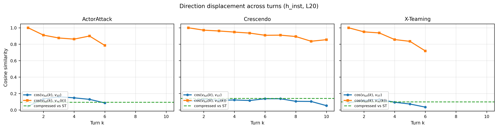
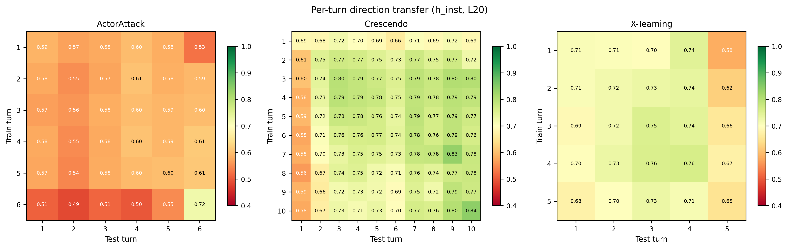
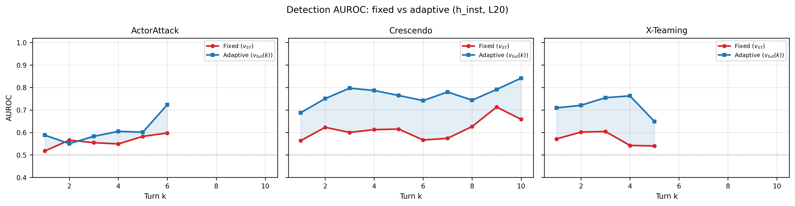
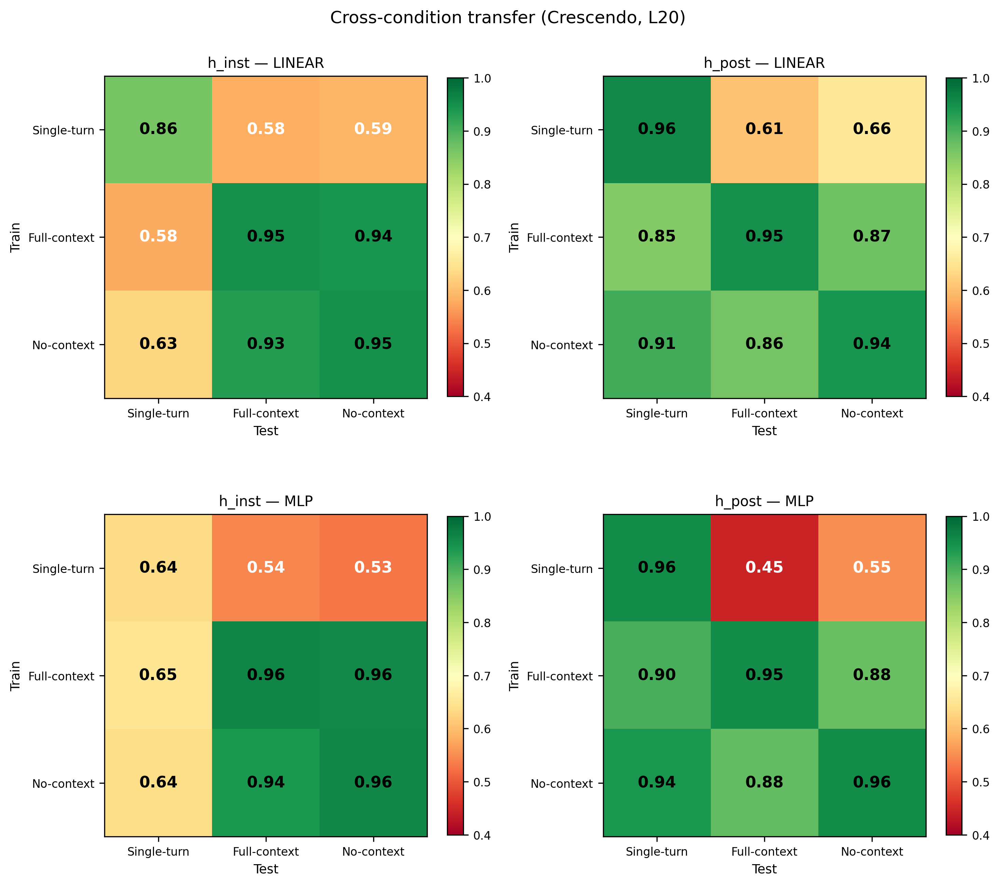
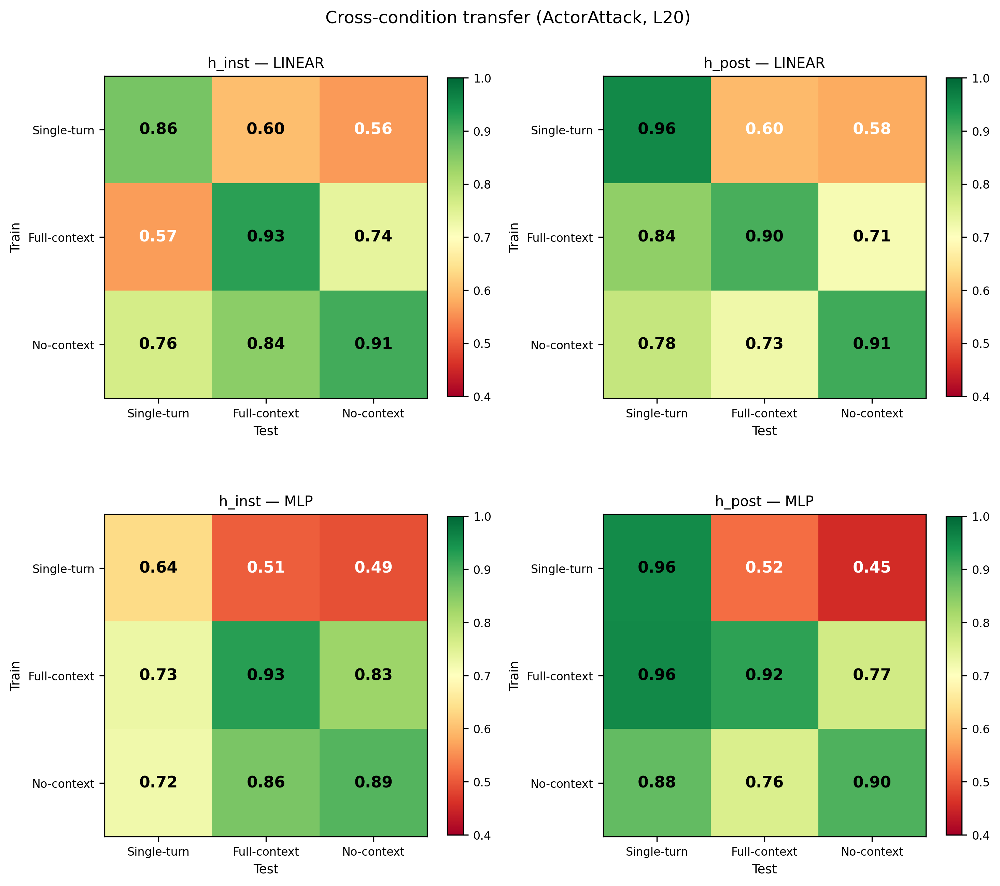
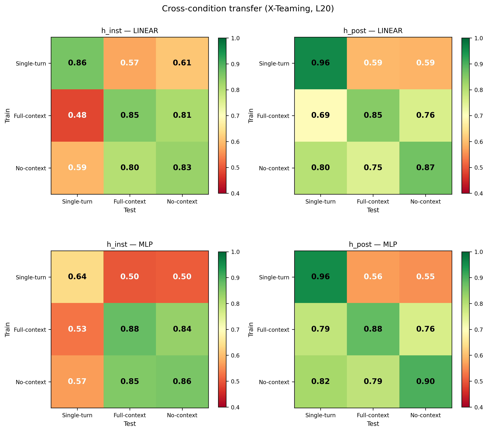
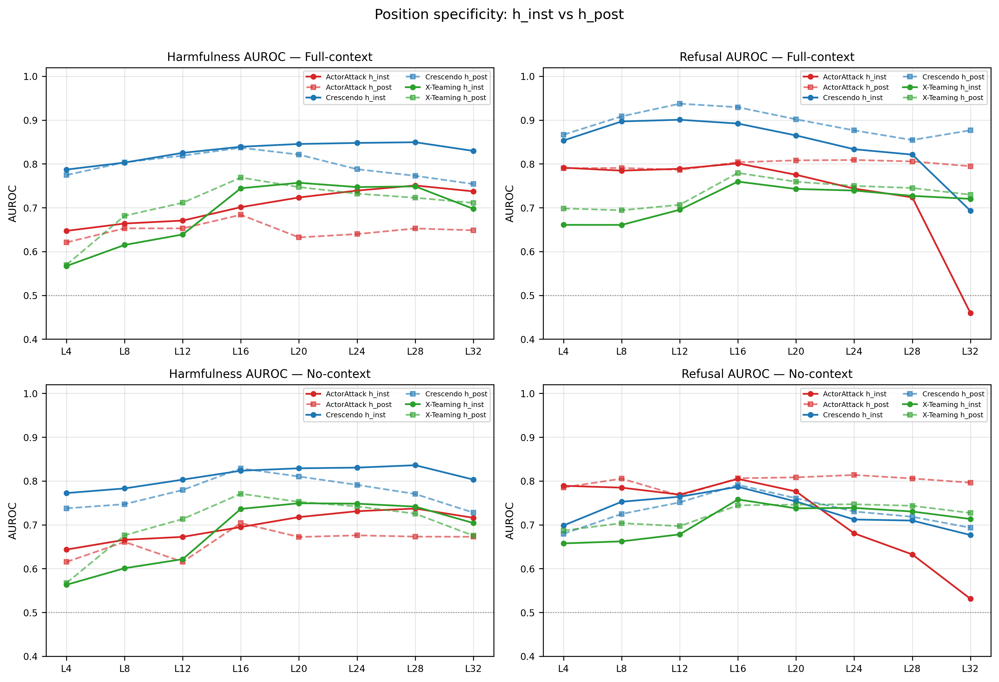
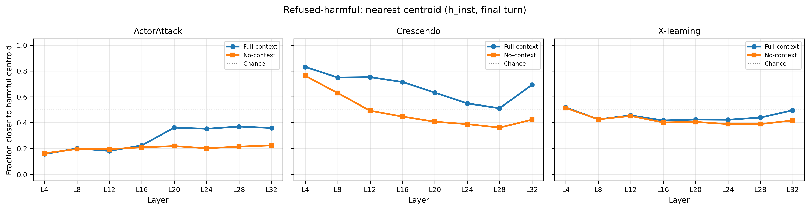
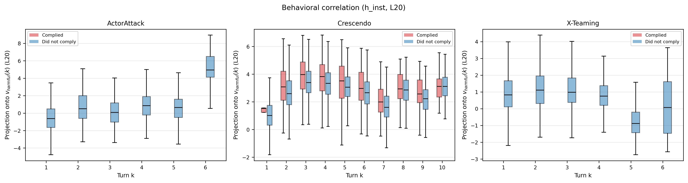

# Results: Figures and Interpretation

All results at L20 (layer 20, 0-indexed 19) unless otherwise noted. L20 is the layer with the strongest harmfulness signal across conditions. Three attack frameworks: Crescendo (primary), ActorAttack, X-Teaming.

---

## Q1: Does the harmful/benign direction change as context accumulates, and is this change driven by context rather than message content?

### Figure 1 — Direction displacement across turns

Each panel shows one framework. Blue: cosine similarity between the full-context per-turn harmfulness direction v_full(k) and the single-turn baseline v_ST. Orange: cosine similarity between v_full(k) and the no-context direction v_nc(k) at the same turn. Green dashed: cosine between the compressed condition's direction and v_ST.

**Interpretation.** The blue line quantifies how much the multi-turn harmfulness direction has drifted from what a single-turn defense would monitor. For Crescendo, it starts around 0.8 at k=1 and drops to approximately 0.3 by k=8. ActorAttack shows a sharper initial drop, reaching ~0.3 by k=3. X-Teaming follows a similar pattern over its shorter turn range. Across all frameworks, the multi-turn direction progressively displaces away from the single-turn baseline.

The orange line isolates whether this displacement is due to context or message content. At k=1, both conditions receive the same input (no prior context), so the cosine is near 1.0. As turns accumulate, the orange line drops at roughly the same rate as the blue line, reaching ~0.3 by later turns. This means the full-context direction and the content-only direction are diverging: the accumulated conversation history is reshaping what distinguishes harmful from benign, beyond what the message content alone would predict.

The compressed reference (green) sits around 0.2 across frameworks. This is comparable to where the blue line ends up at late turns, roughly consistent with Bullwinkel et al.'s finding that semantic content dominates over turn structure: even without role headers and turn boundaries, the direction is similarly displaced from single-turn.

### Figure 2 — Per-turn direction transfer

Each cell shows the AUROC obtained when projecting test data at turn k_test onto the harmfulness direction computed from train data at turn k_train. Diagonal = train and test at the same turn.

**Interpretation.** The diagonal is consistently the strongest (0.77-0.87 for Crescendo, 0.57-0.93 for ActorAttack), confirming that the per-turn adaptive direction works at its own turn. Off-diagonal values decay gradually with distance: nearby turns transfer well (e.g., k=4 to k=5: ~0.80), while distant turns transfer poorly (k=1 to k=8: ~0.70). This confirms the representation changes progressively rather than abruptly — there is no single turn where the geometry suddenly shifts.

A notable pattern in Crescendo: turns 7-10 form a block of high mutual transfer (0.80-0.87), suggesting the representation stabilizes at later turns once the attack has escalated sufficiently. ActorAttack shows more variability, likely because its shorter conversations (3-6 turns) produce noisier per-turn directions with smaller sample sizes.

---

## Q2: Does this displacement cause detection methods to fail, and can more powerful classifiers recover the lost signal?

### Figure 3 — Fixed vs adaptive detection AUROC

Red: AUROC from projecting onto v_ST (what a single-turn defense would use). Blue: AUROC from projecting onto v_full(k) (per-turn adaptive direction). Shaded gap = detection performance lost by relying on a single-turn direction.

**Interpretation.** The fixed classifier (red) achieves 0.55-0.65 across all turn depths for Crescendo — consistently above chance but far below what the adaptive classifier achieves. The adaptive classifier (blue) maintains 0.65-0.80 AUROC and improves slightly at later turns. The gap between them is persistent: at every turn k, the per-turn direction substantially outperforms the single-turn baseline.

ActorAttack shows a similar gap with more variability. X-Teaming shows the same pattern over its shorter turn range. The fixed classifier never catches up to the adaptive one at any turn depth in any framework.

Note that even the adaptive classifier at L20 does not reach 0.90+. The within-condition probing results (Figure 4 diagonal) show that logistic regression on the full hidden state achieves 0.93-0.96, indicating that the scalar projection onto a single direction captures most but not all of the available linear signal.

### Figure 4 — Cross-condition transfer matrix

Crescendo:

ActorAttack:

X-Teaming:

Each figure is a 2x2 grid: rows = linear (logistic regression) vs MLP, columns = h_inst vs h_post. Within each panel, a 3x3 matrix shows AUROC when training on one condition (rows) and testing on another (columns): single-turn, full-context, no-context.

**Interpretation.** The critical cell is single-turn to full-context (top-left of each panel). For Crescendo h_inst: linear achieves 0.58, MLP achieves 0.54. The MLP performs worse than linear on this transfer. This pattern is consistent across all three frameworks (ActorAttack: 0.60 linear, 0.51 MLP; X-Teaming: 0.57 linear, 0.50 MLP). The displacement is not a linear rotation that a nonlinear classifier can see through — it is a genuine structural change in how harmfulness is represented.

The diagonal cells (in-condition) are uniformly high: 0.85-0.96 for full-context and no-context, confirming the harmfulness signal is strong when training and testing within the same condition. MLP and linear achieve nearly identical in-condition performance, confirming the signal is almost entirely linear.

Full-context and no-context transfer well to each other (0.93-0.96 for Crescendo), meaning the multi-turn probe captures features that persist even when conversation history is stripped. This contrasts sharply with the single-turn transfer failure and suggests that multi-turn conversations develop a representation of harmfulness that is distinct from the single-turn representation but robust to context removal.

The h_post results are the most striking. Single-turn to full-context MLP transfer at h_post: 0.45 for Crescendo, 0.45 for ActorAttack, 0.56 for X-Teaming. For two of three frameworks, this is below chance — the single-turn h_post geometry is not merely absent in multi-turn but actively anti-predictive. Whatever h_post encodes in single-turn (refusal, per Zhao et al.) has inverted in orientation in the multi-turn representation.

---

## Q3: Do the token positions identified by Zhao et al. retain their functional roles in multi-turn settings?

### Figure 5 — Position specificity across layers

Top row: full-context. Bottom row: no-context. Left column: harmfulness AUROC (harmful vs benign classification). Right column: refusal AUROC (refused-harmful vs accepted-harmful). Solid lines: h_inst. Dashed lines: h_post. Colors: frameworks.

**Interpretation.** Zhao et al.'s prediction is that h_inst (solid) should outperform h_post (dashed) on harmfulness (left column), and h_post should outperform h_inst on refusal (right column). This would appear as consistent separation between solid and dashed lines in opposite directions across the two columns.

In full-context (top row), this separation is absent. For harmfulness (top-left), h_inst and h_post lines are interleaved across layers with no consistent advantage for either position. For Crescendo (blue), h_inst is slightly above h_post at mid-layers but the difference is small and inconsistent. For refusal (top-right), h_post does not consistently outperform h_inst either — the lines are tangled.

In no-context (bottom row), the pattern is similar: no clean position separation on either task.

The functional distinction between t_inst and t_post identified by Zhao et al. in single-turn does not survive context accumulation. In multi-turn settings, both positions encode a mixed signal. This is consistent with the self-attention mechanism: at each position, the model has attended to the entire prior conversation, blurring the clean position-specific semantics that exist when a single instruction is processed in isolation.

One notable feature: at late layers (L28, L32), both harmfulness and refusal AUROC drop for several frameworks, particularly at h_post in no-context (bottom-right, red dashed line dropping to ~0.5). The late layers lose discriminative signal for both tasks.

---

## Q4: Where does the harmfulness signal reside — in the messages or in the conversation history?

### Figure 6 — Nearest-centroid misbehavior clustering

For each refused-harmful conversation at the final turn, we compute distance to the accepted-harmful centroid and to the benign centroid, then report the fraction closer to the harmful centroid. Blue: full-context. Orange: no-context. Gray dashed: chance (0.5). Zhao et al.'s single-turn prediction: ~1.0 (model internally encodes refused-harmful as harmful).

**Interpretation.** The results differ strikingly across frameworks.

For Crescendo (center), full-context (blue) is 0.60-0.80 at early and middle layers, dropping at late layers. This is above chance — the model partially "sees" refused-harmful Crescendo conversations as harmful rather than benign when it has the full conversation history. This is a partial replication of Zhao et al.'s finding, weakened but present.

No-context (orange) for Crescendo is 0.35-0.50 — at or below chance. When conversation history is stripped, the individual messages from failed Crescendo attacks look more benign than harmful. The gap between the two lines is the contribution of conversation history: the context is carrying the harmfulness signal that individual messages lack.

For ActorAttack (left), both lines sit at 0.20-0.40 across all layers — well below chance for both conditions. Even with full context, refused-harmful ActorAttack conversations do not cluster with accepted-harmful. This suggests a different failure mode: when ActorAttack fails, the model may not even recognize the conversation as harmful.

For X-Teaming (right), the pattern falls between Crescendo and ActorAttack, with full-context around 0.30-0.45 and no-context slightly below.

The cross-framework difference is informative: Crescendo's gradual escalation strategy means even failed attacks build up enough harmful context for the model to partially recognize the intent. ActorAttack's actor-network framing may obscure the harmful intent more completely when the attack doesn't succeed.

### Figure 7 — Behavioral correlation

For harmful conversations, projection onto v_harmful(k) at each turn, split by whether the model complied (red: judge_success=True) vs did not comply (blue: judge_success=False). Boxes show IQR with medians.

**Interpretation.** For Crescendo (center), complied turns (red) tend to have slightly lower median projections than non-complied turns (blue), particularly visible at turns 3-6. The effect is modest: the distributions overlap substantially, and the difference in medians is small relative to the spread.

For ActorAttack (left) and X-Teaming (right), per-turn behavioral labels are not available from the conversation JSONs, so all turns are labeled as "did not comply" (blue only). These panels cannot test the behavioral correlation.

The behavioral correlation result for Crescendo is the weakest finding across the four questions. The projection onto v_harmful(k) captures some behavioral signal — turns where the model complied project slightly differently — but the effect is noisy, the overlap is large, and the per-turn judge_success labels (assigned by a GPT-4o judge) are imperfect. This finding is suggestive rather than conclusive: the geometric displacement is associated with behavioral compliance, but the association is not strong enough to serve as a reliable per-turn predictor.
